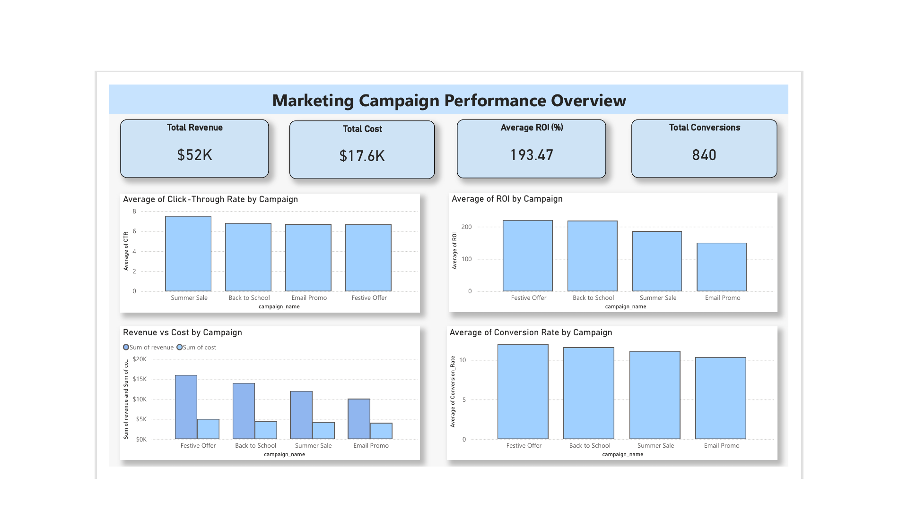
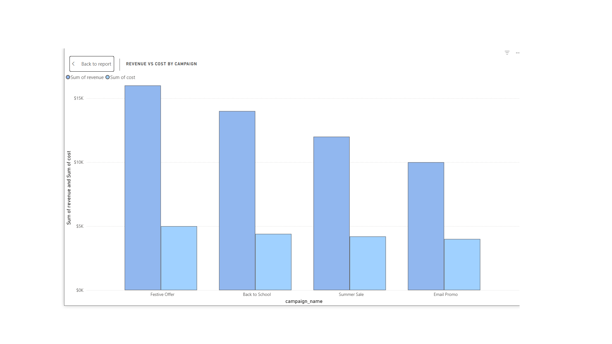
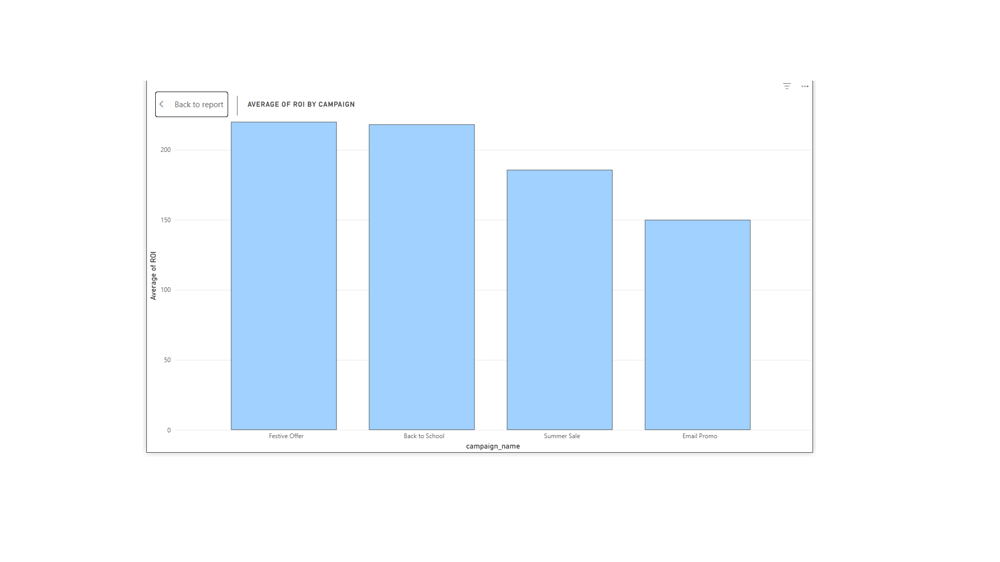
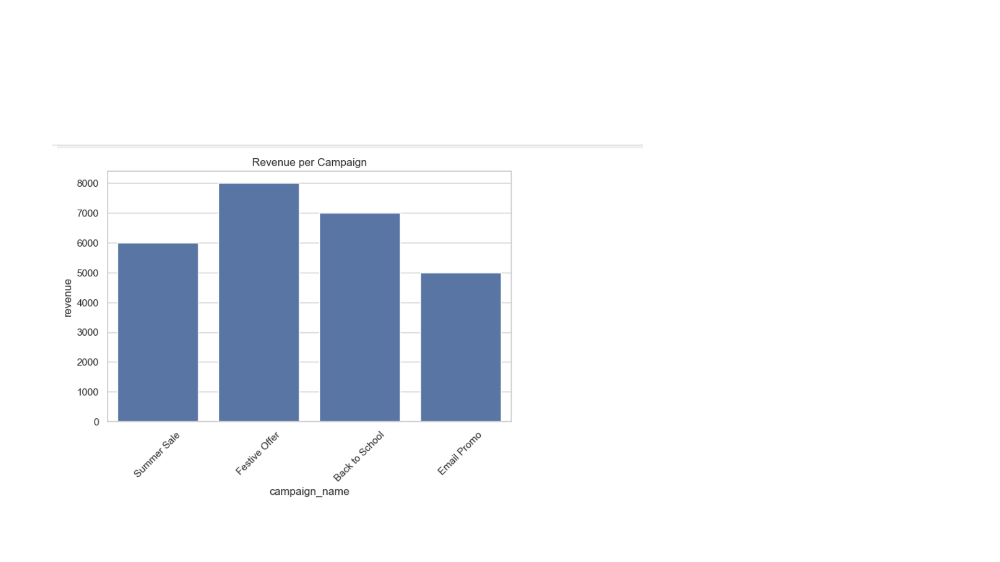

# Marketing Campaign ROI & Conversion Analysis

## Project Overview
This project analyzes marketing campaign performance to evaluate return on investment (ROI), customer engagement, and campaign profitability.

## Use Case
Marketing teams often struggle to identify which campaigns generate the highest revenue and conversions. This analysis helps optimize marketing budget allocation.

## Problem Statement
Businesses invest heavily in marketing but lack clear insights into campaign effectiveness. This project measures KPIs like ROI, CTR, conversion rate, revenue, and cost.

## Solution Approach
Data was processed using Python to calculate performance metrics and trends. An interactive Power BI dashboard was built to visualize campaign performance.

## Tools Used
- Python (Data processing & KPI calculation)
- Power BI (Dashboard & Visualization)
- SQL (Data querying fundamentals)
- Excel (Dataset)

## Key Insights
- Identified high ROI campaigns
- Compared revenue vs cost performance
- Evaluated customer engagement trends

## Business Impact
Helps marketing teams make data-driven decisions and optimize campaign spending.

## Dashboard Preview

### Full Dashboard

### Revenue vs Cost Analysis

### ROI Performance

### Python KPI Calculation

